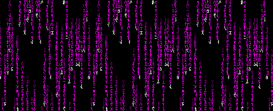

# ⽊ noctira

[](https://github.com/lilit-org/deepseek-agentic-framework-py/actions/workflows/lint.yml)
[](https://github.com/lilit-org/deepseek-agentic-framework-py/actions/workflows/tests.yml)


<br>

noctira is a multifaceted agentic framework for [deepseek-r1](https://ollama.com/library/deepseek-r1), inspired by many open-source frameworks and focused on blockchain and decentralized deployments.

```shell
> make cypherpunk-love

holographic heartbeats bind,
neon echoes of love,
circuit code connecting.
```

## documentation

noctira is an early work in progress and constantly evolving. documentation is being written on [docs](docs/).

## contributing

noctira is open source and open to contributions. keep in mind that the project
is early and core architectural changes are still being made. see the [CONTRIBUTING.md](docs/.internal/CONTRIBUTING.md) file for more information. and
checkout [this guide](docs/development/README.md) for local development.

<br>

<p align="center">

</p>
